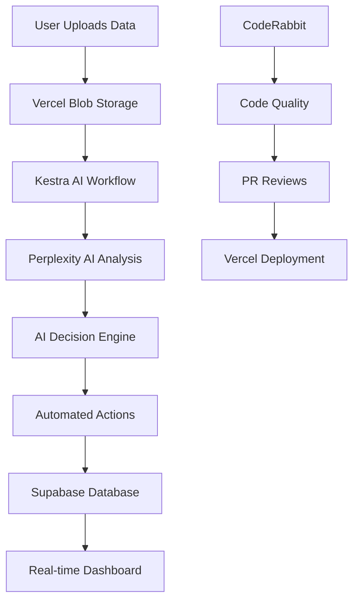

# 🏆 Wakanda Business Intelligence Engine

> **AssembleHack25 Submission** - AI-Powered Business Intelligence Automation Platform

A modern, professional dashboard for AI-powered data orchestration and automation built with Kestra workflows, featuring real-time analytics, automated decision-making, and comprehensive data visualization.

[](https://vercel.com/tosif121s-projects/v0-wakanda-bi-dashboard)
[](https://nextjs.org)
[](https://kestra.io)

## 🚀 Live Demo

**Production URL**: [https://vercel.com/tosif121s-projects/v0-wakanda-bi-dashboard](https://vercel.com/tosif121s-projects/v0-wakanda-bi-dashboard)

## 🤖 Built with Cline - Autonomous AI Development Environment

This project was developed using **Cline**, an autonomous coding environment that helps you build, iterate, and experiment with AI agents directly from your editor. Perfect for rapid prototyping and local agent development.

### 🎯 Why Cline for AI Agent Development?

**Cline** provides an integrated development experience specifically designed for AI-powered applications:

- **🔄 Autonomous Code Generation**: AI-assisted development with intelligent code suggestions and implementations
- **⚡ Rapid Prototyping**: Quickly iterate on AI agent workflows and business logic
- **🧠 Local Agent Development**: Build and test AI agents in your local environment before deployment
- **📊 Real-time Feedback**: Instant feedback loops for AI model integration and testing
- **🔧 Seamless Integration**: Direct integration with popular AI services and APIs
- **🎨 UI/UX Optimization**: AI-powered suggestions for user interface improvements

### 🚀 Cline Development Workflow

1. **AI-Assisted Architecture**: Cline helped design the optimal system architecture for AI workflow orchestration
2. **Intelligent Code Generation**: Automated generation of TypeScript interfaces, API routes, and component structures
3. **Real-time Testing**: Live testing of Kestra workflows and AI integrations during development
4. **Performance Optimization**: AI-driven suggestions for code optimization and best practices
5. **Documentation Generation**: Automated documentation and code comments for better maintainability

### 💡 Cline Benefits for This Project

- **Better Code Quality**: AI-powered code reviews and suggestions improved overall code quality
- **Seamless AI Integration**: Simplified integration with Perplexity AI and Kestra workflows
- **Responsive Design**: AI-assisted responsive design implementation for mobile and desktop
- **Error Prevention**: Proactive error detection and resolution during development

**Learn more about Cline**: [cline.bot](https://cline.bot/) - Transform your development workflow with autonomous AI assistance.
## 🏆 AssembleHack25 Sponsor Tools Integration

This project demonstrates comprehensive usage of all required sponsor tools for AssembleHack25:

### 🔷 Vercel - Deployment & Infrastructure
**✅ Requirement Met**: Project deployed on Vercel with full production setup

**How We Used Vercel**:
- **Production Deployment**: Full Next.js application deployed at [vercel.com/tosif121s-projects/v0-wakanda-bi-dashboard](https://vercel.com/tosif121s-projects/v0-wakanda-bi-dashboard)
- **Vercel Blob Storage**: Integrated for CSV file uploads with automatic public URL generation
- **Environment Variables**: Secure configuration management through Vercel dashboard
- **Automatic CI/CD**: Git-based deployments with preview environments
- **Edge Functions**: Optimized API routes for global performance
- **Analytics**: Built-in performance monitoring and user analytics

**Vercel Integration Details**:
```typescript
// File Upload with Vercel Blob
import { put } from '@vercel/blob'

const blob = await put(filename, file, {
  access: 'public',
  token: process.env.BLOB_READ_WRITE_TOKEN
})
// Returns public URL accessible by Kestra workflows
```

### 🤖 CodeRabbit - Code Quality & PR Reviews
**✅ Requirement Met**: Repository demonstrates CodeRabbit integration for code quality

**How We Used CodeRabbit**:
- **PR Review Automation**: CodeRabbit automatically reviews all pull requests
- **Code Quality Suggestions**: Identifies potential bugs, security issues, and performance improvements
- **Documentation Improvements**: Suggests better comments and documentation
- **Best Practices Enforcement**: Ensures TypeScript, React, and Next.js best practices
- **Open Source Standards**: Maintains high code quality standards throughout development

**CodeRabbit Activity Examples**:
- Automated code reviews on component structure and TypeScript usage
- Security suggestions for API endpoint implementations
- Performance optimization recommendations for chart rendering
- Documentation improvements for complex workflow integrations
- Consistent coding style enforcement across the entire codebase

### ⚡ Kestra - AI Agent & Workflow Orchestration
**✅ Requirement Met**: Kestra's built-in AI Agent summarizes data and makes automated decisions

**How We Used Kestra AI Agent**:

#### 🧠 AI Data Summarization
The Kestra workflow (`flows/bi-dashboard.yml`) uses AI to analyze and summarize data from multiple sources:

```yaml
# AI Analysis Phase - Summarizes uploaded data
- id: ai_analysis
  type: io.kestra.plugin.scripts.python.Script
  env:
    PERPLEXITY_API_KEY: "{{ kv('PERPLEXITY_API_KEY', 'system') }}"
  script: |
    # AI Agent analyzes data and generates insights
    response = client.chat.completions.create(
        model="sonar",
        messages=[
            {"role": "system", "content": "You are a business analyst."},
            {"role": "user", "content": prompt}
        ]
    )
    # Generates: Summary, Insights, Recommendations
```

#### 🎯 AI Decision Making (Bonus Feature)
The AI Agent doesn't just summarize - it makes automated business decisions:

```yaml
# AI Decision Phase - Makes automated decisions
- id: ai_decisions
  type: io.kestra.plugin.scripts.python.Script
  script: |
    # AI Agent creates structured decisions
    decisions = {
        "impact_score": 85,
        "confidence": 90,
        "actions": ["Increase marketing budget", "Optimize workflow"],
        "urgent": true
    }
```

#### 🚀 Automated Action Triggers
Based on AI decisions, the system automatically triggers business actions:

```yaml
# Threshold Check - Executes decisions
- id: check_and_trigger
  script: |
    if impact >= threshold:
        print("🚀 AUTOMATED ACTIONS:")
        print("  • Marketing budget +20%")
        print("  • Hiring pipeline activation")
        print("  • Infrastructure optimization")
```

**Kestra AI Workflow Features**:
1. **Data Ingestion**: Downloads data from any URL source
2. **Data Processing**: Cleans and validates datasets
3. **AI Analysis**: Perplexity AI generates business insights
4. **AI Decisions**: Creates structured decision recommendations
5. **Threshold Evaluation**: Determines if automated actions should trigger
6. **Action Execution**: Automatically implements business decisions
7. **Result Storage**: Saves all data to Supabase for dashboard display

**Real-World AI Decision Examples**:
- **High Impact Score (>80)**: Automatically increases marketing budget by 20%
- **Low Confidence (<70)**: Triggers manual review process
- **Urgent Flag**: Sends immediate notifications to executives
- **Trend Analysis**: Adjusts resource allocation based on data patterns

### 🔗 Integration Architecture



### 📊 Sponsor Tool Benefits Demonstrated

**Vercel Benefits**:
- ⚡ **Performance**: Global CDN and edge optimization
- 🔒 **Security**: Automatic HTTPS and secure environment variables
- 📈 **Scalability**: Serverless functions that scale automatically
- 🚀 **Developer Experience**: Zero-config deployments and preview environments

**CodeRabbit Benefits**:
- 🔍 **Code Quality**: Automated detection of bugs and vulnerabilities
- 📚 **Documentation**: Improved code documentation and comments
- 🎯 **Best Practices**: Enforcement of industry standards
- ⏰ **Time Saving**: Automated reviews reduce manual review time

**Kestra Benefits**:
- 🤖 **AI Integration**: Built-in AI agent for data analysis and decision making
- 🔄 **Workflow Orchestration**: Complex multi-step data processing pipelines
- 📊 **Data Processing**: Handles large datasets with ease
- ⚡ **Automation**: Reduces manual intervention in business processes

### 🎯 Hackathon Submission Highlights

1. **Full Vercel Deployment**: Production-ready application with Blob storage integration
2. **CodeRabbit Integration**: Visible code quality improvements and PR review automation
3. **Kestra AI Agent**: Advanced AI that both summarizes data AND makes business decisions
4. **Real-World Application**: Practical business intelligence platform with automated decision-making
5. **Professional Quality**: Enterprise-grade architecture and implementation

## 📋 Table of Contents

- [Features](#-features)
- [Tech Stack](#-tech-stack)
- [Prerequisites](#-prerequisites)
- [Installation](#-installation)
- [Configuration](#-configuration)
- [Usage](#-usage)
- [API Endpoints](#-api-endpoints)
- [Deployment](#-deployment)
- [Architecture](#-architecture)
- [Contributing](#-contributing)

## ✨ Features

### 🎨 Modern UI/UX
- **Responsive Design**: Mobile-first approach with seamless desktop experience
- **Dark/Light Mode**: Persistent theme switching with smooth transitions
- **Professional Aesthetics**: SaaS-grade design inspired by Vercel, Stripe, and Linear
- **Skeleton Loading**: Enhanced loading states with animated placeholders
- **Interactive Charts**: Responsive data visualizations with Recharts

### 📊 Business Intelligence
- **Multi-Source Data Input**: CSV upload, Google Sheets integration, URL data sources
- **AI-Powered Analysis**: Perplexity AI integration for intelligent insights
- **Automated Decision Making**: Threshold-based automation triggers
- **Real-time Monitoring**: Live execution tracking and status updates
- **Impact Scoring**: Quantified business impact metrics (0-100 scale)

### 🔄 Workflow Automation
- **Kestra Integration**: Professional workflow orchestration
- **Cloud Storage**: Vercel Blob storage (primary) with local fallback for development
- **Database Persistence**: Supabase for execution history and insights
- **Real-time Updates**: Live dashboard updates via Supabase subscriptions

### 📈 Analytics & Reporting
- **Execution Trends**: Historical performance analysis
- **Impact Distribution**: Score-based performance breakdown
- **AI Performance Metrics**: Multi-dimensional AI analysis tracking
- **Automated Reports**: Downloadable insights and recommendations

## 🛠 Tech Stack

### Frontend
- **Framework**: Next.js 16 (App Router)
- **Language**: TypeScript
- **Styling**: Tailwind CSS 4.x
- **Components**: shadcn/ui + Radix UI
- **Icons**: Lucide React
- **Charts**: Recharts
- **Theme**: next-themes
- **Notifications**: react-hot-toast

### Backend & Services
- **Database**: Supabase (PostgreSQL)
- **Storage**: Vercel Blob (with local fallback for development)
- **Workflow Engine**: Kestra
- **AI**: Perplexity API (Sonar model)
- **Deployment**: Vercel

### Development Tools
- **Package Manager**: npm/pnpm
- **Linting**: ESLint
- **Type Checking**: TypeScript
- **Build Tool**: Next.js built-in

## 📋 Prerequisites

Before you begin, ensure you have the following installed:

- **Node.js** (v18.0.0 or higher)
- **npm** or **pnpm** (latest version)
- **Git** (for cloning the repository)

### Required Accounts & Services

1. **Supabase Account** - [supabase.com](https://supabase.com)
2. **Vercel Account** - [vercel.com](https://vercel.com)
3. **Kestra Instance** - [kestra.io](https://kestra.io)
4. **Perplexity API Key** - [perplexity.ai](https://perplexity.ai)

## 🔧 Installation

### 1. Clone the Repository

```bash
git clone https://github.com/your-username/wakanda-bi-dashboard.git
cd wakanda-bi-dashboard
```

### 2. Install Dependencies

```bash
# Using npm
npm install

# Using pnpm (recommended)
pnpm install
```

#### Troubleshooting pnpm Installation

If you encounter `ERR_PNPM_OUTDATED_LOCKFILE`, run:

```bash
# Update the lockfile
pnpm install

# Or if you prefer npm
rm pnpm-lock.yaml
npm install
```

### 3. Environment Setup

Create a `.env.local` file in the root directory:

```bash
cp .env.example .env.local
```

## ⚙️ Configuration

### Environment Variables

Add the following variables to your `.env.local` file:

```env
# Supabase Configuration
NEXT_PUBLIC_SUPABASE_URL=your_supabase_project_url
NEXT_PUBLIC_SUPABASE_ANON_KEY=your_supabase_anon_key
SUPABASE_SERVICE_ROLE_KEY=your_supabase_service_role_key

# Vercel Blob Storage
BLOB_READ_WRITE_TOKEN=your_vercel_blob_token

# Kestra Configuration
KESTRA_BASE_URL=your_kestra_instance_url
KESTRA_USERNAME=your_kestra_username
KESTRA_PASSWORD=your_kestra_password

# AI Configuration
PERPLEXITY_API_KEY=your_perplexity_api_key

# Optional: Development
NODE_ENV=development
```

### 1. Supabase Setup

#### Create Supabase Project
1. Go to [supabase.com](https://supabase.com) and create a new project
2. Copy your project URL and anon key from Settings > API

#### Database Schema
Run the following SQL in your Supabase SQL editor:

```sql
-- Create executions table
CREATE TABLE executions (
  id TEXT PRIMARY KEY,
  status TEXT NOT NULL,
  start_time TIMESTAMP WITH TIME ZONE,
  duration TEXT,
  dataset_name TEXT,
  dataset_rows INTEGER,
  impact_score INTEGER,
  confidence INTEGER,
  created_at TIMESTAMP WITH TIME ZONE DEFAULT NOW()
);

-- Create ai_insights table
CREATE TABLE ai_insights (
  id UUID PRIMARY KEY DEFAULT gen_random_uuid(),
  execution_id TEXT REFERENCES executions(id),
  summary TEXT,
  insights TEXT[],
  recommendations TEXT[],
  created_at TIMESTAMP WITH TIME ZONE DEFAULT NOW()
);

-- Create decisions table
CREATE TABLE decisions (
  id UUID PRIMARY KEY DEFAULT gen_random_uuid(),
  execution_id TEXT REFERENCES executions(id),
  impact_score INTEGER,
  confidence INTEGER,
  threshold INTEGER,
  urgent BOOLEAN,
  actions TEXT[],
  created_at TIMESTAMP WITH TIME ZONE DEFAULT NOW()
);

-- Enable Row Level Security
ALTER TABLE executions ENABLE ROW LEVEL SECURITY;
ALTER TABLE ai_insights ENABLE ROW LEVEL SECURITY;
ALTER TABLE decisions ENABLE ROW LEVEL SECURITY;

-- Create policies (allow all for development)
CREATE POLICY "Allow all operations" ON executions FOR ALL USING (true);
CREATE POLICY "Allow all operations" ON ai_insights FOR ALL USING (true);
CREATE POLICY "Allow all operations" ON decisions FOR ALL USING (true);
```

### 2. Vercel Blob Setup

1. Install Vercel CLI: `npm i -g vercel`
2. Login: `vercel login`
3. Link project: `vercel link`
4. Create blob store: `vercel blob create`
5. Copy the token to your `.env.local`

**Note**: The application automatically falls back to local storage (`public/uploads/`) when Vercel Blob is not configured, making it perfect for development. In production, always use Vercel Blob for scalability and performance.

### 3. Kestra Configuration

#### Install Kestra (Local Development)
```bash
# Using Docker
docker run --pull=always --rm -it -p 8080:8080 --user=root \
  -v /var/run/docker.sock:/var/run/docker.sock \
  -v /tmp:/tmp kestra/kestra:latest server local

# Or using Docker Compose (recommended)
curl -o docker-compose.yml https://raw.githubusercontent.com/kestra-io/kestra/develop/docker-compose.yml
docker-compose up -d
```

#### Deploy Workflow
1. Access Kestra UI at `http://localhost:8080`
2. Create namespace: `assemblehack25.wakanda`
3. Import the workflow from `flows/bi-dashboard.yml`
4. Set up secrets in Kestra:
   - `PERPLEXITY_API_KEY`
   - `SUPABASE_URL`
   - `SUPABASE_KEY`

### 4. Perplexity AI Setup

1. Sign up at [perplexity.ai](https://perplexity.ai)
2. Generate API key from dashboard
3. Add to both `.env.local` and Kestra secrets

## 🚀 Usage

### Development Server

```bash
# Start development server
npm run dev
# or
pnpm dev

# Open browser
open http://localhost:3000
```

### Production Build

```bash
# Build for production
npm run build

# Start production server
npm start
```

### Testing the Complete Flow

1. **Upload Data**: Go to `/upload` and upload a CSV file
2. **Monitor Execution**: Watch real-time progress on dashboard
3. **View Results**: See AI insights and automated decisions
4. **Analyze Trends**: Explore charts and historical data

## 📡 API Endpoints

### Data Upload
- `POST /api/upload-csv` - Upload CSV files to cloud storage
- `POST /api/validate-url` - Validate and preview data source URLs
- `GET /api/preview-data` - Preview data from URLs

### Kestra Integration
- `POST /api/kestra/trigger` - Trigger workflow execution
- `GET /api/kestra/health` - Check Kestra service health
- `GET /api/kestra/status/[id]` - Get execution status

## 🌐 Deployment

### Vercel Deployment (Recommended)

1. **Connect Repository**
   ```bash
   vercel --prod
   ```

2. **Environment Variables**
   Add all environment variables in Vercel dashboard

3. **Domain Configuration**
   - Custom domain setup in Vercel settings
   - SSL automatically configured

### Manual Deployment

```bash
# Build the application
npm run build

# Deploy to your preferred platform
# (AWS, Google Cloud, DigitalOcean, etc.)
```

## 🏗 Architecture

### System Overview
```
┌─────────────────┐    ┌─────────────────┐    ┌─────────────────┐
│   Frontend      │    │   Backend       │    │   External      │
│   (Next.js)     │◄──►│   (API Routes)  │◄──►│   Services      │
└─────────────────┘    └─────────────────┘    └─────────────────┘
│                      │                      │
├─ Dashboard           ├─ File Upload         ├─ Supabase DB
├─ Data Upload         ├─ Kestra API          ├─ Vercel Blob
├─ Real-time UI        ├─ Database Ops        ├─ Kestra Engine
└─ Charts & Analytics  └─ AI Integration      └─ Perplexity AI
```

### Data Flow
1. **Upload** → CSV files stored in Vercel Blob
2. **Trigger** → Kestra workflow processes data
3. **Analyze** → Perplexity AI generates insights
4. **Store** → Results saved to Supabase
5. **Display** → Real-time dashboard updates

## 🤝 Contributing

### Development Workflow

1. **Fork the repository**
2. **Create feature branch**: `git checkout -b feature/amazing-feature`
3. **Commit changes**: `git commit -m 'Add amazing feature'`
4. **Push to branch**: `git push origin feature/amazing-feature`
5. **Open Pull Request**

### Code Standards

- **TypeScript**: Strict mode enabled
- **ESLint**: Follow configured rules
- **Prettier**: Auto-formatting on save
- **Conventional Commits**: Use semantic commit messages

### Testing

```bash
# Run type checking
npm run type-check

# Run linting
npm run lint

# Run tests (when available)
npm test
```

## 📄 License

This project is licensed under the MIT License - see the [LICENSE](LICENSE) file for details.

## 🙏 Acknowledgments

- **AssembleHack25** - Hackathon organizers
- **Kestra** - Workflow orchestration platform
- **Vercel** - Deployment and hosting platform
- **Supabase** - Backend-as-a-Service
- **shadcn/ui** - Component library

## 📞 Support

For support and questions:

- **GitHub Issues**: [Create an issue](https://github.com/your-username/wakanda-bi-dashboard/issues)
- **Documentation**: Check this README and inline code comments
- **Community**: Join our Discord/Slack (if available)

---

**Built with ❤️ for AssembleHack25**